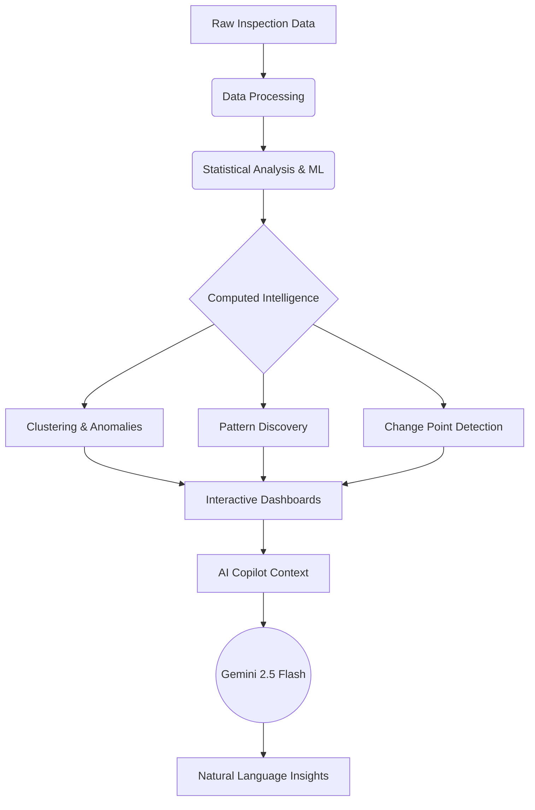
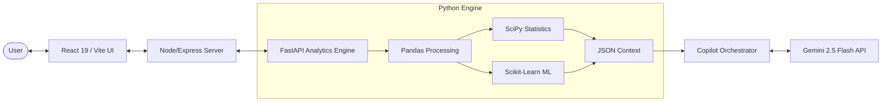

<div align="center">
  <h1>DEFECTIQ</h1>
  <h3>AI-Powered Manufacturing Intelligence</h3>
  <p><em>Turn manufacturing inspection data into actionable defect intelligence.</em></p>

  <p>
    
    
    
    
    
  </p>
</div>

<br />

---

## 2. Project Overview

**DefectIQ** is an AI-powered manufacturing intelligence platform that analyzes factory inspection data to identify defect patterns, risky machines, batches, and shifts. By combining classical statistical methods, unsupervised machine learning, and an AI Copilot, DefectIQ helps quality engineers and plant managers move from raw CSV/XLSX data to actionable insights in seconds.

Instead of writing complex SQL queries or building manual dashboards, users can explore computed findings, identify root-cause associations, and ask natural-language questions about their inspection data.

---

## 3. Problem Statement

Modern factories generate massive amounts of inspection data, but extracting meaning from it is challenging:

- **Volume & Complexity:** Manually parsing millions of rows to find multi-variable defect patterns is nearly impossible.
- **Hidden Associations:** It is difficult to identify when specific combinations (e.g., a specific machine during a specific shift with high temperature) drive defects.
- **Statistical Interpretation:** Distinguishing random noise from statistically significant shifts requires data science expertise.
- **Slow Investigations:** Quality engineers spend too much time building ad-hoc reports instead of fixing the root cause.

---

## 4. Solution

DefectIQ automates the analytical workflow by preprocessing the data and running a battery of statistical and ML algorithms to present ready-to-use intelligence.



---

## 5. Key Features

### 📊 Manufacturing Analytics
- **Defect Analysis:** Track overall defect rates over time with EWMA smoothing.
- **Factor Tracking:** Breakdown by Machine, Batch, Shift, and Defect Type.

### 🔍 Pattern Investigation
- **Combinatorial Slicing:** Multi-factor pattern discovery (depth 1-3).
- **Contribution Ranking:** Discover the highest contributing factors for any defect type.
- **Statistical Rigor:** Lift, Effect Size, and Chi-Square association tests.
- **Information Theory:** Mutual Information scores for feature importance.
- **Decision Trees:** Interpretable shallow decision-tree splits to identify critical thresholds.

### 🚨 Anomaly & Change Detection
- **Rolling Z-Score:** Detect unusual deviations from baseline defect behavior.
- **CUSUM Detection:** Identify persistent shifts in process levels (change-point detection).

### 🧩 Clustering
- **PCA Visualization:** 2D projections of high-dimensional inspection telemetry.
- **K-Means Clustering:** Grouping similar records, with automatic K selection via Silhouette Scores.
- **DBSCAN:** Noise and anomaly outlier detection.

### 🤖 AI Copilot
- **Natural-Language QA:** Ask questions directly about the dataset.
- **Grounded LLM:** Responses are strictly based on pre-computed statistical context to avoid hallucinated numbers.
- **Powered by Gemini 2.5 Flash:** Fast and intelligent reasoning.

### 📄 Reporting
- **Exportable Insights:** Generate PDF and CSV reports for offline analysis and record-keeping.

---

## 6. AI Approach

DefectIQ is **not** a simple LLM wrapper or a standard RAG application.

The core philosophy of DefectIQ is **Grounded Intelligence**:
1. **Analytics Engine First:** All statistical calculations, clustering, and aggregations are performed deterministically by the Python/Scikit-Learn backend. 
2. **Context Assembly:** The results (patterns, change points, cluster profiles) are serialized into a highly structured JSON context.
3. **LLM Interpretation:** The Gemini 2.5 Flash model receives *only* this computed context and the user's question. 
4. **Guardrails:** The AI is instructed to never compute statistics itself, must cite numbers verbatim from the JSON, and clearly state that correlation does not imply causation.

This architecture ensures high accuracy, prevents mathematical hallucinations, and delivers reliable industrial-grade insights.

---

## 7. Technical Architecture



---

## 8. Tech Stack

| Layer | Technology | Purpose |
|------|------------|---------|
| **Frontend** | React 19, TailwindCSS, Radix UI, Recharts | Interactive dashboards, visual analytics, and Copilot UI |
| **Proxy / Web Server** | Node.js, Express | API routing, static serving |
| **Analytics Engine** | Python, FastAPI | High-performance backend serving the ML pipelines |
| **Data Processing** | Pandas, NumPy | Data manipulation and aggregation |
| **Statistics** | SciPy | Chi-Square tests (`chi2_contingency`), confidence intervals |
| **Machine Learning** | Scikit-Learn | PCA, K-Means, DBSCAN, Decision Trees, Mutual Information |
| **AI / LLM** | Gemini 2.5 Flash | Natural language reasoning for the AI Copilot |
| **Deployment** | Docker | Containerized Node + Python multi-process environment |

---

## 9. Analytics & ML Methods

Every method in DefectIQ serves a specific analytical purpose:

- **Lift:** Measures how strongly a factor (e.g., `Machine 4`) is associated with a defect compared to the global baseline.
- **Chi-Square (χ²):** Tests whether categorical variables and defect outcomes are statistically dependent, producing a p-value for confidence.
- **Mutual Information:** Measures the dependency between a feature and the defect outcome, helping rank root causes.
- **K-Means:** Groups similar inspection records into clusters (e.g., "Stable Operation" vs. "Hot & Defective").
- **PCA:** Projects high-dimensional parametric data (temperature, pressure, speed) into lower dimensions for visual cluster analysis.
- **DBSCAN:** Identifies dense groups and isolates noise/outliers in the process telemetry.
- **Z-Score (Rolling):** Detects short-term unusual spikes in defect rates.
- **CUSUM:** Detects persistent, long-term shifts in the defect rate (change points).
- **Decision Tree:** Provides interpretable factor splits (e.g., `Temperature > 45.2`) for immediate investigation.

---

## 10. Data Flow

1. **Import:** User uploads an inspection dataset (CSV/XLSX).
2. **Mapping:** System validates and maps columns (timestamp, machine_id, defects, etc.).
3. **Pre-computation:** The FastAPI engine calculates baseline KPIs, daily trends, and EWMA.
4. **Pattern Mining:** Combinatorial slicing discovers multi-factor defect associations.
5. **Clustering & Anomalies:** K-Means, PCA, Z-Scores, and CUSUM are executed.
6. **Visualization:** The React frontend renders the computed results.
7. **Investigation:** User queries the AI Copilot, which translates the pre-computed JSON into natural language explanations.
8. **Export:** User downloads a PDF/CSV investigation report.

---

## 11. AI Copilot

The AI Copilot allows users to interact with their data naturally. Because it is grounded in deterministic statistical outputs, it is reliable for manufacturing decisions.

### Example Questions
- *"Which machine has the highest defect rate?"*
- *"What factor has the strongest association with 'Scratch' defects?"*
- *"When did the defect rate significantly change?"*
- *"What are the characteristics of Cluster 2?"*
- *"Are there any specific shifts I should investigate?"*

---

## 12. User Workflow

1. **Import Data:** Upload factory inspection records.
2. **Review Summary:** Check high-level KPIs and active alerts.
3. **Explore Intelligence:** Dive into automatically discovered patterns and multi-factor lifts.
4. **Investigate Factors:** Use Mutual Information and Decision Trees to isolate root causes.
5. **Analyze Trends:** View CUSUM change points and Z-score anomalies.
6. **Explore Clusters:** Analyze process parameter regimes via PCA and K-Means.
7. **Ask Copilot:** Query specific findings in natural language.
8. **Generate Report:** Export findings for the engineering team.

---

## 13. Results & Outputs

DefectIQ provides users with:
- Ranked high-risk machines, batches, and shifts.
- Statistically significant multi-factor defect patterns.
- Exact dates of process shifts (change points).
- Segmented operational clusters with parameter profiling.
- Interpretable decision-tree thresholds for immediate process adjustment.
- Exportable investigation reports.

---

## 14. Project Structure

```text
defectiq/
├── client/                 # React 19 / Vite frontend application
│   ├── public/
│   └── src/                # Components, pages, and UI logic
├── engine/                 # Python Analytics Engine Core
│   ├── clustering.py       # KMeans, PCA, DBSCAN
│   ├── contribution.py     # Mutual Information, Decision Trees, Chi-Square
│   ├── copilot.py          # Gemini 2.5 Flash orchestration & context building
│   ├── pattern_engine.py   # Multi-factor combinatorial slicing & Lift
│   ├── trends.py           # Z-Score, CUSUM, EWMA
│   └── ...
├── server/                 # Node.js Express proxy and static server
├── shared/                 # Shared TypeScript types/schemas
├── Dockerfile              # Multi-stage build (Node + Python venv)
├── engine_api.py           # Python engine logic entry points
├── engine_server.py        # FastAPI server wrapping the engine
├── package.json            # Node dependencies
└── README.md
```
